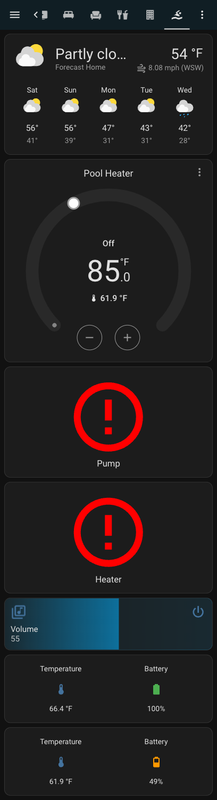

-----

ACTIVELY WORKING TO MOVE THIS OVER TO A MORE FEATURE RICH IMPLEMENTATION
https://github.com/azerty9971/xtend_tuya/issues/346#issuecomment-2967370954

If you want to leverage this while it's still under review you can add my github fork to HA under HACS (https://github.com/EvanSchalton/xtend_tuya.git) then install the tuya_xtend integration.
Oncce this is merged into Azerty's repo you should be able to install that over the fork w/out issue (or reconfiguration).

-----


# Hardware
- Sensor: [IBS-M2](https://amzn.to/3wX0Ir3)
- Switch: [Dwenwils Pool Timer](https://amzn.to/3wX0Ir3)

All in I spent ~$150, the cheapest alternative I could find was ~$650

# Configuration
I have two of the Dwenwils Pool Timers, one controlling my pump and the other controlling my heater.

## Other Automations
> Add a variable to detect when the heater was last turned off, configure your pump to stay on (or turn back on) for 20 minutes after the heater was last one. Some heaters say they don't need the pump to remain on, but this will almost certainly increase the longevitiy of your heater

Use the generic_thermostat to control a pool heater

```yaml
climate:
  - platform: generic_thermostat
    name: Pool Heater
    heater: switch.pool_heater_socket_1
    target_sensor: sensor.ibs_m2_temperature_2
    min_temp: 75
    max_temp: 100
    ac_mode: false
    target_temp: 85
    cold_tolerance: 2.0
    hot_tolerance: 2.0
    min_cycle_duration:
      seconds: 600
    initial_hvac_mode: "off"
    away_temp: 80
    precision: 0.1
```

# Dashboard

## Current Pool Dashboard (for Inspiration)



### Glance Yaml:
```yaml
show_name: true
show_icon: true
show_state: true
type: glance
entities:
  - entity: sensor.ibs_m2_temperature_3
    name: Temperature
  - entity: sensor.ibs_m2_ch_2_battery
    name: Battery
state_color: true
```

### Pump Yaml

`It's disabled right now because the breaker is off for my pool house`
```yaml
type: custom:button-card
name: Pump
show_state: false
show_icon: true
show_name: true
entity: switch.pool_pump_socket_1
icon: mdi:water-pump
state:
  - operator: template
    value: |
      [[[ return entity.state === 'on'; ]]]
    styles:
      icon:
        - color: rgb(16, 30, 194)
  - operator: template
    value: |
      [[[ return entity.state === 'off'; ]]]
    icon: mdi:water-pump-off
    styles:
      icon:
        - color: rgb(90, 90, 90)
  - operator: template
    value: >
      [[[ return entity.state === 'unknown'; ]]]  # Set "unknown" as the default
      state
    icon: mdi:alert-circle-outline
    styles:
      icon:
        - color: rgb(255, 0, 0)
tap_action:
  action: toggle

```

### Heater

`It's disabled right now because the breaker is off for my pool house`

```yaml
type: custom:button-card
name: Heater
show_state: false
show_icon: true
show_name: true
entity: switch.pool_heater_socket_1
icon: mdi:heat-wave
state:
  - operator: template
    value: |
      [[[ return entity.state === 'on'; ]]]
    styles:
      icon:
        - color: rgb(194, 28, 16)
  - operator: template
    value: |
      [[[ return entity.state === 'off'; ]]]
    icon: mdi:heat-wave
    styles:
      icon:
        - color: rgb(90, 90, 90)
  - operator: template
    value: >
      [[[ return entity.state === 'unknown'; ]]]  # Set "unknown" as the default
      state
    icon: mdi:alert-circle-outline
    styles:
      icon:
        - color: rgb(255, 0, 0)
tap_action:
  action: toggle

```

# Automations
Turn on the pump anytime the heater is on:
```yaml
- id: 'xxxxxx'
  alias: Pump turns on with heater
  description: ''
  trigger:
  - platform: state
    entity_id:
    - switch.pool_heater_socket_1
    attribute: 'On'
  condition: []
  action:
  - type: turn_on
    device_id: xxxxxx
    entity_id: xxxxxx
    domain: switch
  mode: single
```

Run the pump for 20 minutes after the heater turns off
```yaml
alias: Turn off pump first
description: ""
trigger:
  - platform: device
    type: changed_states
    device_id: __pump_device_id__
    entity_id: __pump_entity_id__
    domain: switch
condition:
  - condition: device
    type: is_on
    device_id: __heater_device_id__
    entity_id: __heater_entity_id__
    domain: switch
action:
  - type: turn_on
    device_id: __pump_device_id__
    entity_id: __pump_entity_id__
    domain: switch
  - type: turn_off
    device_id: __heater_device_id__
    entity_id: __heater_entity_id__
    domain: switch
  - delay:
      hours: 0
      minutes: 20
      seconds: 0
      milliseconds: 0
  - if:
      - condition: device
        type: is_off
        device_id: __heater_device_id__
        entity_id: __heater_entity_id__
        domain: switch
    then:
      - type: turn_off
        device_id: __pump_device_id__
        entity_id: __pump_entity_id__
        domain: switch
mode: restart
```
> This should be improved upon: I could store pump/heater on/off timestamps to action if the pump should stay on after the heater turns off -- I haven't tested this w/ the new themostat controller so they may interact oddly, in which case I'll need to update.

# Other Ideas
1. I'll probably add weather integration that controls the pool temp based on the weather (no point in heating when it's raining or on a particularly cool night or overcast day where we wont want to swim)
2. I happen to have multiple sensors, instead of having one sit on the shelf I'm going to play with creating a sensor that averages the and is used as the `target_sensor` in the climate control.

# Ways to support:
- [](https://www.buymeacoffee.com/evanschalton)
- Cosign the [issue](https://github.com/tuya/tuya-device-sharing-sdk/issues/11) on Tuya's sdk (give it a thumbs up or add a comment in support)
